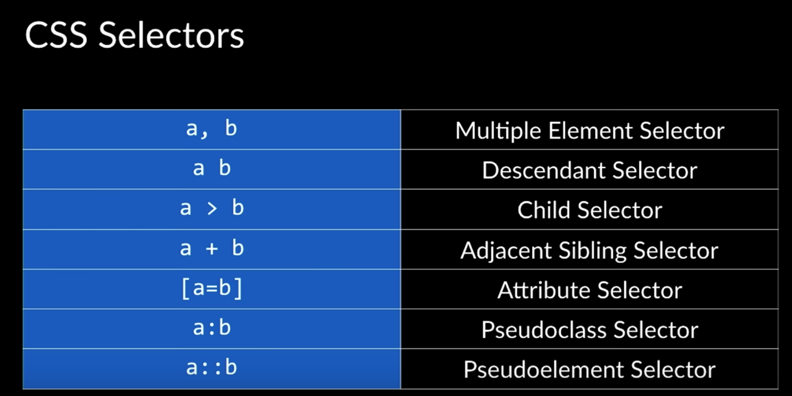
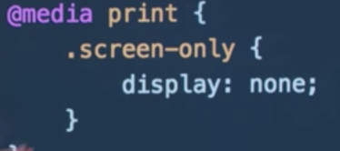
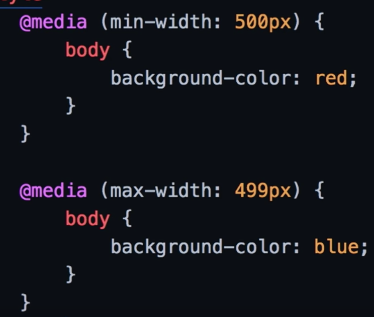
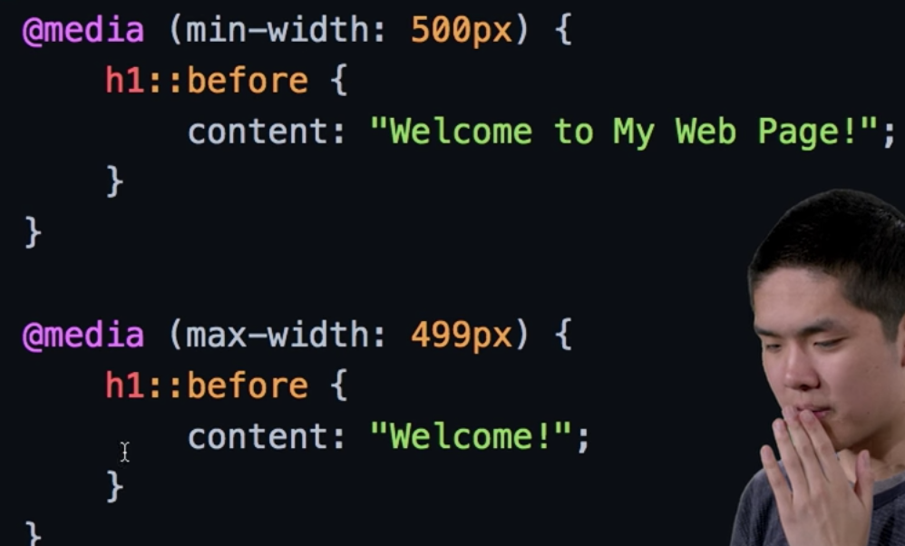
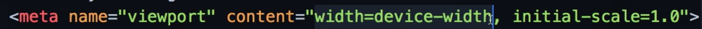
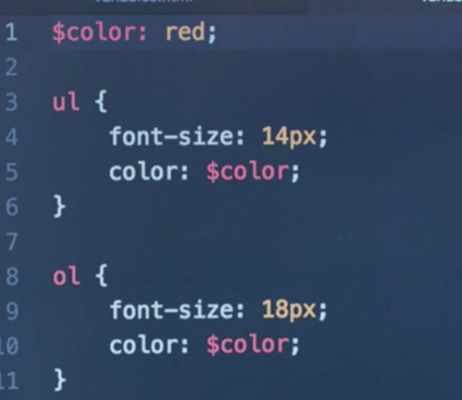
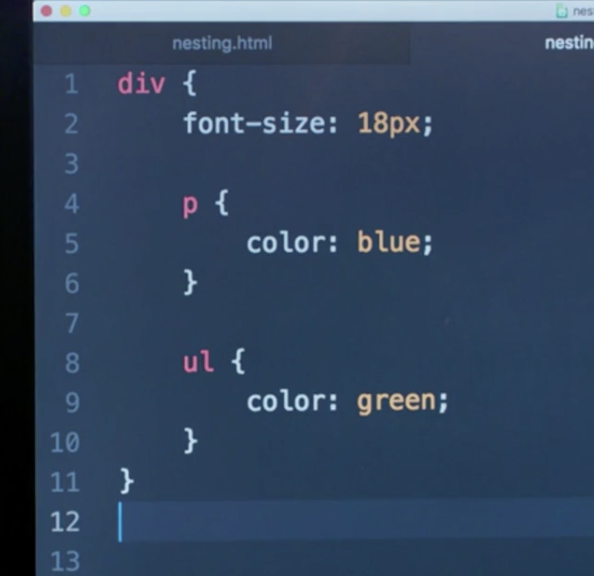
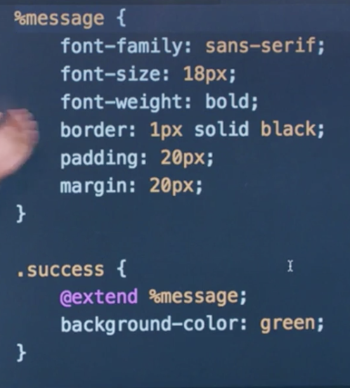

# CS50 Web: Lcture 1 HTML, CSS 

## Outline  
* Git: advanced topics
	* Branch
	* Remotes
	* Forks 
	* Pull Requests 
* Advanced HTML / CSS 
* Responsive Design 

### Git: Branching
* __HEAD__: points where you are in the branches. 
* `git branch`: list all the braches in the repository 
* `git branch <branch_name>`: create a new branch 
* `git checkout <branch_name>`: move to a different branch
* `git merge <branch_name>`: marge the branch name into the current branch you are right now.
* `git push --set-upstream origin <branch_name>`: push commits from a new branch to remote repo. 
* Later, just use `git push` to push things to the current branch. 

### Remotes
* __Remote__: a version of the repository stored on the Internet. By default `origin` is the name of a remote. 
* `git fetch`: download commits from the remote and the _origin/master_ will be downloaded. 
* `git merge origin/master`: marge your current (master) branch with origin/master. 
* `git pull`: simple command allows you to do both of the above. 

### Forks 
* fork: an entire copy of the original repository that belongs to you and won't affect the original one.

### Pull Requests 
* Pull Request: you would like to merge your changes in some branch to some other branch or even a branch in an other repository. 

### HTML (cont.)
* __Links__: `<a href="<URL>"> Link </a>`: takes you to a link; `<a href="#section1"> section 1 </a>`: takes you to a section on this page via id attributes. 
* HTML 5 new tags:
	* `<header>` 
	* `<nav>`
	* `<section>`
	* `<footer>` 
	* `<audio>`
	* `<video>`
	* `<datalist>`
	* and more... 
* Radio Buttons: `<input type="radio"> option1`
* pull-down automatically filled-in list:  
`<input list="<datalist_name>">`   
`<datalist id="datalist_name">`  
`----<option value="">`  

### CSS (cont.)
* `ol li`: all the tags of `<li>` that contained inside `<ol>` tags are styled. 
* `ol > li`: only the tags of `<li>` that are immediate children of `<ol>` tags are styled. 
* input forms can only accept numbers or other restricted types. 
* `input[type=text]`: style `<input>` tags whose type is "text"
* `button:hover`: (pseudoclass) specified hover style is a state for when button is hovered on. 
* `a::before`: specify & style the info before the contents of `<a>` tags. 
* `p::selection`: style when something is selected. 
__Summary of CSS Selectors__
 

### Responsive Design
* we want the website to be responsive on all kinds of devices. 
* media printing resposnive example:  
`
`  
  
* responsive size: 

_showing "red" when the window is at least 500px in width. Otherwise, showing "blue"._
* responsive content: 
 
* rendering viewpoint size on different devices: 

* `<flex-box>`: allowing contents to wrap around based on the width of the browser. `display:flex` 
* __Bootstrap__: A CSS library. Add a `<link rel="stylesheet" href="URL">` to the `<head>`. It uses a 12-column systematic layout. For example, `<class="col-3">`. 
* classes: `<class="col-lg-3 col-sm-6">` make sure the website is responsive on both large and small devices. 
* the more specific styling takes precedent. 
* create alert messages - `<class="alert alert-primary">` 

### Sass
* an extension on CSS in a more powerful way. [Sass](https://sass-lang.com/)
* you can define variables in Sass. 
  
* though you need to compile Sass file to a CSS file `>> sass file.scss file.css`
* Sass allows for better nesting. 
 
* Inheritance 
 

