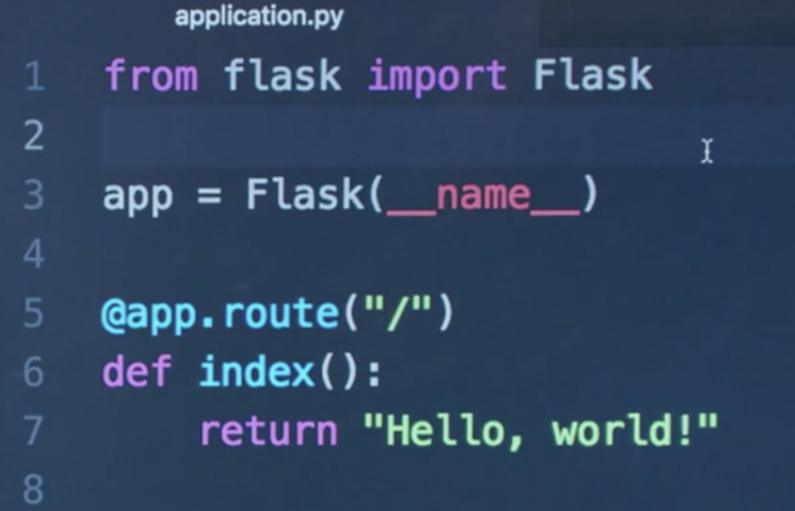
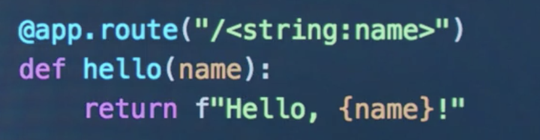
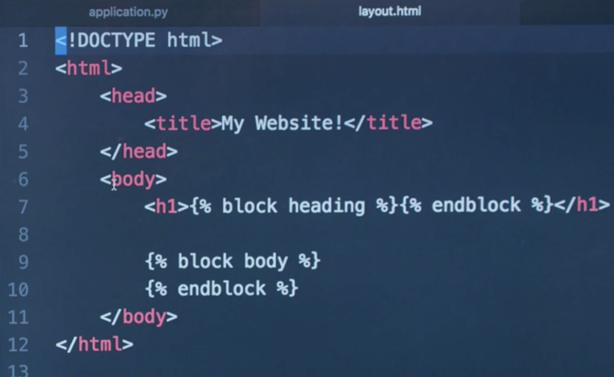
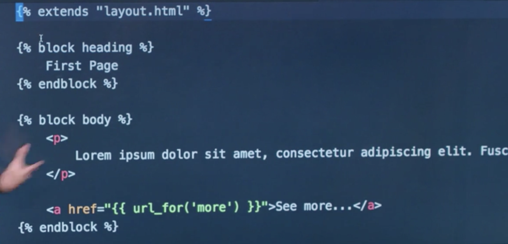

# CS50 Web: Lecture 2 Flask 

## Outline
* Python Basics

### Python Language 
* placeholders in python3.6: `print(f"hello, {name}")`  
* when importing a module, code in that module will be run unless you include them in a `main()` function. 

### HTTP - HyperText Transfer Protocol 
* request 
* response

### Flask 
* handling server-side of things: requests & responses
* the main file of flask application: `application.py` 
 
* run an Flask application: `flask run` 
* set the env variable: `>>> export FLASK_APP=application.py` 
* URL decorator: `@app.route("/leon")` 
 
* HTML tags can be added to strings to be later rendered on the browser. 
* `{{headline}}`: placeholder inside HTML, commonly between tags. 
* introducing Python-like code - _Jinja2_ into HTML: `` 
* block of HTML code can be introduced by Jinja2 syntax and then be inherited by other HTML files. 
 
 
