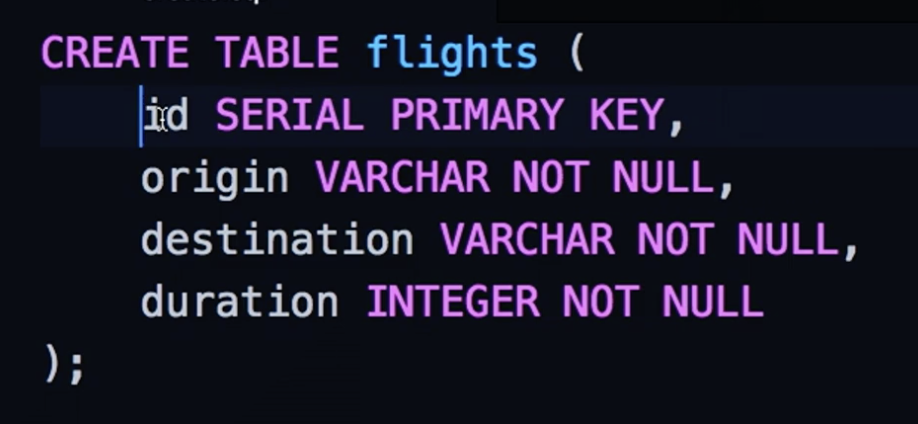

# CS50 Web: Lecture 3 SQL 

## Outline
* SQL Basics 
* SQL with flask 

### PostgreSQL 
* when creating a table, we need to decide what types of data it will hold. 
	* SERIAL: automatically increment its value 
 
* constraints can be added to table columns when creating table. 
 
* FOREIGN KEY: build a relationship between tables. 
	* Benefits: 
	* save space 
	* keep organized  
* REFERENCES (the primary key): build a connection between 2 table columns on 2 different tables so that we can't do something to break the constraint. 
* CREATE INDEX: easy way of looking for something. - Tradeoff: a) more space occupied & b) takes more time to update a table/column. 
* DB server terminal commands: 
	* go to `>>> psql <bd name>` to run database server and type commands inside the terminal 
	* `>>> \d`: list all the DB tables
	* `>>> \q`: quit psql  
* SQL commands:  
	* `INSERT INTO flights (origin, destination, duration) VALUES ('New York', 'London', 415);` 
	* `SELECT origin, destination FROM flights WHERE duration > 420 AND origin = 'New York';` 
	* `SELECT AVG(duration) FROM flights WHERE origin = 'New York';`
	* `SELECT COUNT(*) FROM flights WHERE origin = 'New York';`
	* `UPDATE flights SET duration = 430 WHERE origin = 'New York' AND destination = 'London';` 
	* `DELETE FROM flights WHERE destination = 'Tokyo';` 
	* `SELECT * FROM flights LIMIT 2`: only list 2 rows
	* `SELECT * FROM flights ORDER BY duration ASC;` 
	* `SELECT origin, COUNT(*) FROM flights GROUP BY origin HAVING COUNT(*) > 1;`  
	* `SELECT * FROM table1 JOIN table2 ON table1.id = table2.table1_id;` 

### SQL Security Concerns 
* __SQL Injection__:  usually occurs when you ask a user for input, like their username/userid, and instead of a name/id, the user gives you an SQL statement that you will unknowingly run on your database. Ans: constraints, escaping. 
* Race Conditions: == contention. Ans: Transactions.  
* SQL Transactions: BEGIN & COMMIT.  

### SQL with Flask 
* use sqlalchemy library 
* when inserting, deleting, updating your DB, commit your changes. 
* DB URL: `"postgresql://<username>:<password>@<server>:<port>/<database>"` 
* `db.commit()`: only execute SQL commands right after this line. 
* sqlalchemy will avoid SQL injection by escaping potentially dangerous characters by using placeholders and dictionary to form a query. 
* read carefully over `airline0` & `airline1` folders. 
