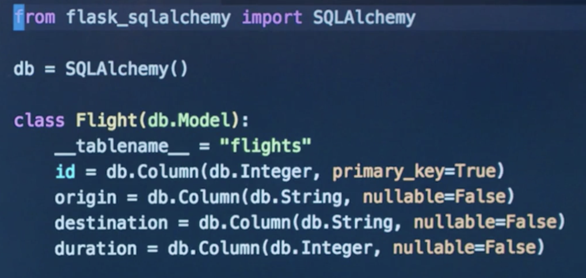

# CS50 Web: Lecture 4 ORMs & APIs 

## Outline
* OOP 
* ORM 
* API 

### OOP 
* `if __name__ == "__main__":`: it is good to have this when creating Python scripts (especially needed when importing a file). 

### Object-Relational Mapping
* use Python objects (attributes, methods) to interact with SQL database. 
* `flask_sqlachemy`: ties Python code with Flask & SQL databases 
* one table == one Python class model 
 
* `db.create_all()`: create all tables in the `model.py` 
* `db.session.add(obj)`: insert a row 
* `Flight.query.all()`: select all from flight table (or model) 
* `Flight.query.filter_by(origin="Paris").all()`: select based on conditions. 
* `db.session.commit()`
* `Flight.query.get(28)`: get row object with id == 28. 
* `db.session.delete(obj)` 
* `Flight.query.filter(Flight.origin != "Paris").all()` 
* `db.session.query(Flight, Passenger).filter(Flight.id == Passenger.flight_id).all()`: join SQL query 
* `db.relationship(...)`: relate 2 DB tables together  

### API 
* protocols for communication between either different web applications or different parts of the same application. 
* JSON: readable data format for data transfering. 
 
* use URLs to access JSON API object. 
* the HTTP request method type will correspond to the type of action we want to perform. 
* HTTP methods (convention many APIs will follow):  
 
* `requests` library: handling interactions with HTTP requests. 
* `requests.get(URL)`: getting the source code of the website. 
* All request functions in the `requests` library: 
  
* `fixer.io`: an existing API on the website we can play with. 
* Common Status Code for a HTTP request 
 
* `jsonify`: a function in flask to convert dict to json. 
* API Keys: with larger APIs, you may need to provide API key to make a request. In this way, we can then restrict the frequency of their requests to ensure no overloading on the servers. 
