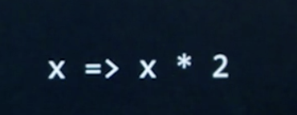

# CS50 Web: Lecture 5 Javascript  

## Outline
* Client vs. Server
* Javascript 
* 

### Client vs. Server 
* flask/python on server while HTML/CSS/JS are mostly local on client computers. 
* advantages of running code on the client side: 
	* take off the load from the server 
	* it's faster 

### Javascript - ES6 
* `` 
* `alert()`
 
* Events
 
* `document.querySelector(`h1`).innerHTML = 'Good!'`: extract HTML element (only find the first HTML tag) and modify it. 
 
* `let counter = 0;`: var definition 
* `counter % 10 === 0`: checking equality. 
* formatted string 
 
* refactor JS out of HTML (when DOM is fully loaded): 
 
* defining variables 
	* const: constants
	* let: scoping is the innermost curly braces 
	* var: exists in the innermost function 
 
* for HTML tags, we can add attribute like `data-<placeholder>` to specify user-defined additional info. 
 
* Arrow Functions: defining functions more easily 
 
 
 
* this is referred to object before the function(). 
 

