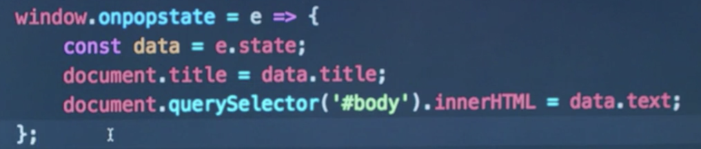
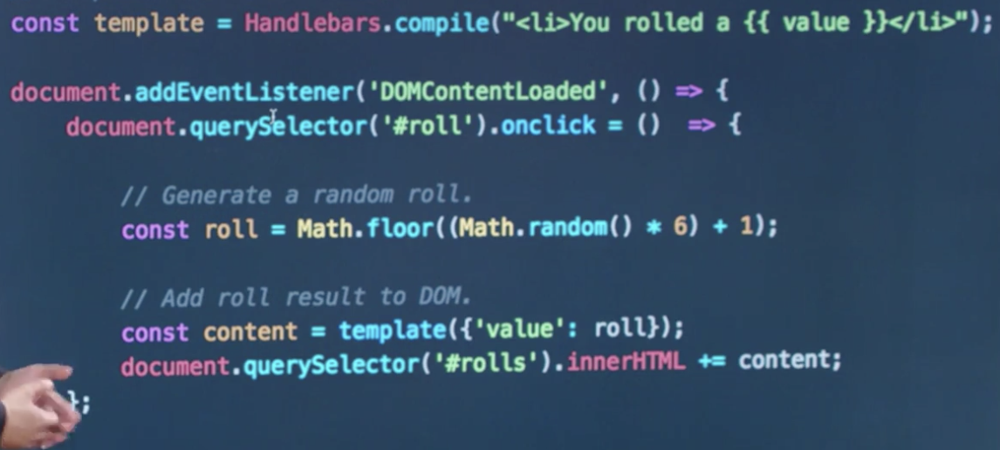
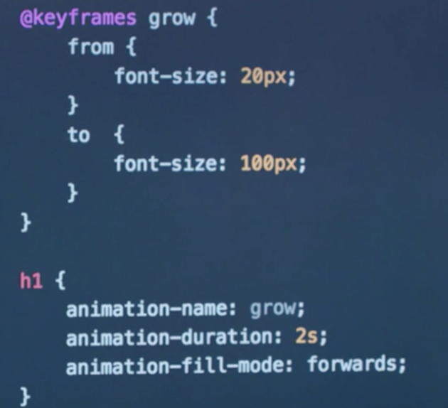
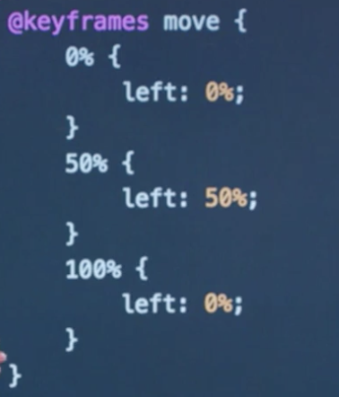
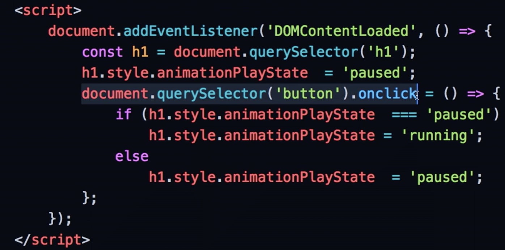
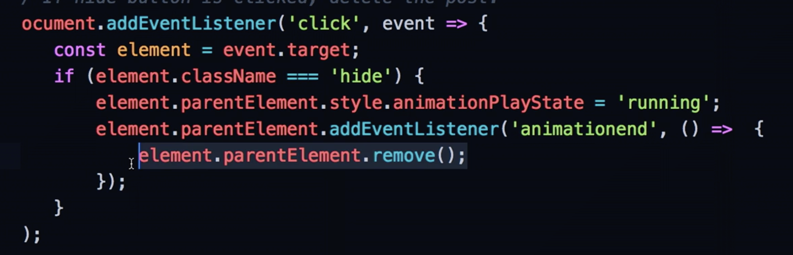

# CS50 Web: Lecture 6 Front Ends   

## Outline
* Single-Page Apps 
* HTML5 History API 
* Infinite Scrolling 
* Hiding Contents  
* Javascript Templating 
* CSS Animation 
* Scalable Vector Graphics (SVG)

### Single-Page Apps 
* taking multi-page of HTMLs and combining them into one page. 
* Advantages: 
	* no need to reload the page 
* Disadvantages: 
	* URL does not change; might be more useful to display the entire URL. 
* src: `multipage` `singlepage0` 

### HTML5 Hitory API 
* manipulate the browser history effectively and update the URL to reflect different URLs. 
* `history.pushState()`: update the URL. Use the data argument to store data. 
* `window.onpopstate()`

* src: `singlepage1` `singlepage2` 

### Infinite Scroll 
* window: a few useful attributes - `window.innerWidth` `window.innerHeight` `document.body.offsetHeight` `window.scrollY` 
* be able to detect the user scrolls to the end of the page; useful when you need infinite scrolling like Facebook 
* advantages: 
	* page loading performance 
* src: `scroll.html` `posts0` 

### Hiding Contents 
* `this.parentElement.remove();`: remove parent element 
* src: `posts1` 

### Javascript Templating 
* build templates in JS that allows us to write HTML code and then insert to DOM. 
* `Handlebars`: one of such libraries 
 
* Jinja requires a flask application server so that Jinja templates can be generated; JS templates are all on the client side. 
* `#each`: helpers for looping over JS arrays. 
* src: `dice0` `dice1` `dice2` `dice3` `posts2`

### CSS Animation 
* `@keyframes ***`: defining animations in CSS 
 
* intermediate steps: * percent through the animation
 
* use JS to interact with CSS animation 
 
* Animation can be used to interact with JS events listeners. 
 
* src: `animate0.html` `animate1.html` `animate2.html` `animate3.html` `posts3` `posts4` 

### Scalable Vector Graphics (SVG)
* `<svg>`: parent SVG tags in HTML
* D3: JS library to create interactive graphs and charts. 
* D3 also allows event listeners on SVG objects. 
* D3 also allows for canvas painting with event listeners. 
* src: `circle0.html` `circle1.html` `rect.html` `circle2.html` `circle3.html` `spotlight.html` `draw0.html` `draw1.html` `draw2.html` `draw2.js` 