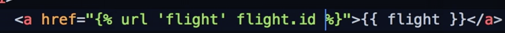
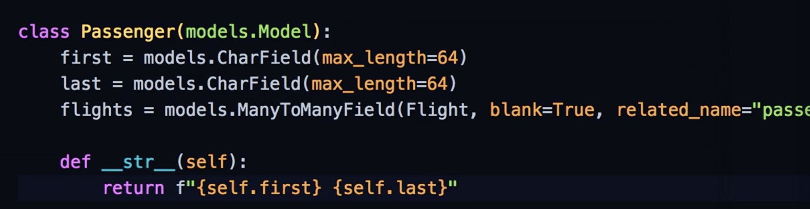

# CS50 Web: Lecture 7 Django    

## Outline
* Basic Files
* Databases
* Template Rendering  
* Admin Interface 
* Named Routes 
* Many-to-Many Relationships 
* Authentication 

### Basics Files
* `>>> django-admin startproject <projectname>`: initiate a Django project 
* the initial framework: 
	* `__init__.py`: tells us the directory is a python package. 
	* `manage.py`: don't necessarily need to modify it. 
	* `settings.py`: initial settings 
	* `urls.py`: takes care all routes of the web app.  
	* `wsgi.py`: for deployment
* A Django project usually consists of 1 or multiple Django applications. 
* Each Django application servers a particular purpose or has a particular function. 
* `>>> python3 manage.py startapp <app_name>`: initiate a Django App and create a dir for it.  
* Files inside an app:
	* `views.py`: what users would see 
	* `urls.py`: a file that specifies URLs for this app 
	* `models.py`: where to define classes of types of data 
* Remember to link your application URL file to Project URL file
 
* `>>> python3 manage.py runserver`: run the web app
* src: `mysite`

### Databases 
* defining a data class in `models.py` (or table in DB) 
* Django has a machemisn called migrations that will automatically detect any change in models.py and generate SQL code to run on the DB. 
* `python3 manage.py makemigrations`:  create data models (auto-add id column) and generate SQL code for updates 
* `python3 manage.py sqlmigrate <app_name> <migration_id>`: see the SQL code for that migration 
* `python3 manage.py migrate`: apply the actual migration  
* add app config   and database config to `settings.py` 
* `python3 manage.py shell`: access the shell program in Django. Can be used to add data to the DB. 
 
_remember to save the vars you create by `var.save()`_

### Template Rendering 
* create HTMLs in `app_name/templates/...` but when referencing it use `"app_name/file.html"` 

### Admin interface 
* `admin.site.register(Model)`: registering models with admin site. 
* `python3 manage.py createsuperuser` : creating a suoper user that would have access to the database. 
* `../admin`: will be the web interface for the back-end DB system. 
* It's an App but register all the models in the project. 

### Named Routes
* In `urls.py`, you can add an additional name to each URL for future reference s. 
 

### Many-to-Many Relationships 
* by convention, we achieve this many-to-many relationships by creating a in-between table to  create a mapping between 2 or more models. 
* the Django approach: 
 
* src: `airline`

### Authentication 
* `ajango.contrib.auth`: where most of functions we can use. 
* 
* Django suppots session. 
* src: `authentication`