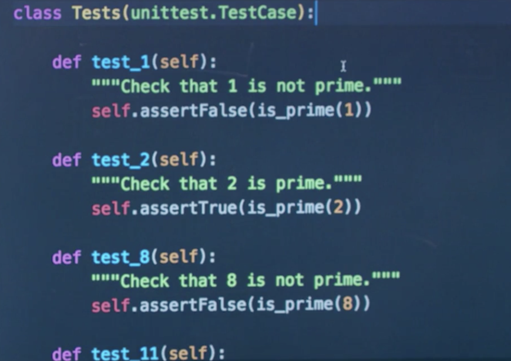

# CS50 Web: Lecture 8 Testing, CI/CD    

## Outline
* Customise the Admin Interface
* Static File Import 
* Python Unit Testing 
* Web Application Unit Testing 
* Testing JS 
* CI / CD 
* Travis CI 
* Docker 

### Customise the Admin Interface 
* by extending the existing data model class  
 

### Static File Import 
* importing static file - path: `app_name/static/app_name/file.css` 
* can be used for media files, css, js and more 
* src: `airline0` 

### Python Unit Testing 
* for basic python script testing on the terminal: `from file import function/data` 
* use bash scripts for multiple commands 
* `assert()`: Python built-in function to perform sanity checks. 
* `>>> echo $?`: check the status code previously ran. 0 is fine; otherwise something went wrong. 
* `unittest`: Python library for unit testing 
 
* src: `prime.py` `tests0.py` `tests0.sh` `assert0.py` `assert1.py` `tests1.py` 

### Web Application Unit Testing 
* In Django, `tests.py` will be used for testing. 
* `from django.test import TestCase`: an extension of the unittest.
* Django creates a testing DB for those tests. 
* `python3 manage.py test`: actually run the tests.  
* Testing Views: 
 
 
* src: `airline1` `airline2`

### Testing JS  
* use browser testing tools (e.g. `selenium`) to use Python code to test JS/browser interactions. 
* src: `selenium` 

### CI / CD 
* contiuous integration
	* frequent merges to main branch 
	* automated unit testing 
* continuous deliver 
	* automated application deployment 
* CI Tools
	* CircleCI 
	* Codeship 
	* Jenkins 
	* Travis CI 

### Travis CI 
 

* YAML: common file format for configuration 
 
 
* `.travis.yml`: is the configuration file but usually hidden by the OS.  
* src: `airline3` 

### Docker 
* creating isolated containers
 
* for resolving dependencies, creating stable environment and composing external servers. 
 
* `docker-compose up`: start off the web app in a docker. 
* `docker exec -it <container_id> bash -l`: access a container & make modifications. 
* src: `airline4` 