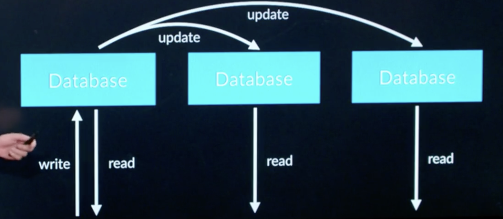
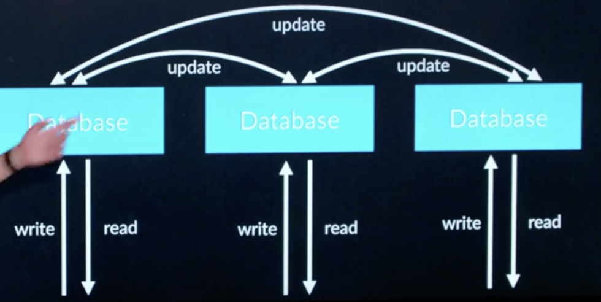

# CS50 Web: Lecture 10 Scalability 

## Outline
* Benchmarking
* Vertical Scaling 
* Horizontal Scaling 
* Load Balancing 
* Autoscaling
* Scaling Database 
* Database Replication 
* Caching 

### Benchmarking 
* how much your server can handle within a given time. 

### Vertical Scaling 
* increase computational capacity, memory  on a machine 
* hardware limitation 

### Horizontal Scaling 
* increase the number of servers 
* concerns: data sharing, distributing requests (load balancing) 

### Laod Balancing 
* Random choice 
* Round Robin
* Fewest Connections (more computationally expensive)
* __Session-Aware Load Balancing__
	* sticky session: direct following requests from the same user to the same server
	* sessions in DB: all servers share the same DB for user sessions. DB has to scale as well. Communication costs.  
	* Client-Side Sessions: cookies - storing info on user local machines. 

### Autoscaling 
* server load may vary 
* automatically scaling the number of active servers using thresholds 

### Scaling Database 
* __Database Partitioning__
	* vertical database partitioning (divide tables into more smaller tables and link by foreign keys)
	* horizontal database partitioning (split rows into multiple tables) - tradeoff: query can be fast but additional logic in code, schema change should be reflected on multiple tables, invalid data and queries of bring all tables together may be slower. 

### Database Replication 
* to avoid loss of data from single point of failure in the database 
* make multiple copies of databases - issue: out of sync among databases 
* __Single-Primary Replication__: a primary database  & multiple secondary databases. Drawbacks: race conditions, concurrency issues, won't handle frequent writes. 
 
* __Multi-Primary Replication__: multiple read-write databases. Drawbacks: concurrency issues, more updates among the cluster, id collisions.  

### Caching 
* taking data and info and storing them somewhere for later usages. 
* __Client-Side Caching__: browser saves the cache. In the HTTP header add `Cache-Control: max-age=86400`. Issues: page changes sooner will not reflect. Also, send a Etag along with the request and compare with the one on the server to identify whether there is a change. Benefits: reduce server load, fast. 
* __Server-Side Caching__: cache is stored on the server so that we can access some info faster than query databases every time. Drawbacks: cache invalidation (out of sync from databases). 

 